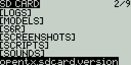
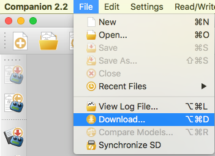

# microSD Card

Check the Tx documentation from the manufacturer to determine which
microSD card to use. To use the microSD card insert it into the card
slot.
- Format: FAT12/16/32

The mmicro sd card contents depending on your radio type, the sound
files, lua scripts, themes and model images. Since sound files and lua
scripts need to matched to a OpenTX version, OpenTX checks the version
of the SD card contents and warns if the sd card files have the wrong
version.

## Version Warning

If a microSD Card is present when the Tx is turned on OpenTX check its root/top level folder for a file to determine if the correct sound pack version is being used.
- opentx.sdcard.version

  

If the incorrect version is being used then it is possible that some announcements such as telemetry units will be incorrect and other file such as lua scripts are outdated.

## SD Card contents

The standard SD card contents are available from within Companion.
- File > Download

  
  
- Click on Download SD contents

  
  
- The zip file available for download depends on the Companion radio
  profile being used.
- Click on the zip file link to download the microSD card contents

  
  
- Extract the ZIP file to the root/top level folder of the microSD Card. 

  

 
 

## Folder structure
###  Sound files on SDCARD

See the [Sounds & Announcements](advanced/audio.md) section for
details on the sound files on the sdcard.

### IMAGES folder: This is where you place the images that you want to
use as model logos. Filenames must be 10 chars long or less (not
including extension). A collection of files is available here. Placing
the cursor over a valid file in this folder will show it on the right
side of the screen, and in the contextual menu you will find an entry
to assign the selected image to the current model.

- Taranis: 64x32, 4-bit grayscale .bmp. See [Tutorial on Open-TXU](http://open-txu.org/home/continuing-education/create-your-own-model-image/) how to create these images. 
- Horus: RGB Jpeg, max 192x116. 

### EEPROM folder
    This folder contains the backups made of the transmitter's EEPROM. 

### FIRMWARE folder
This folder contains firmwares that can be flashed with the bootloader or from OpenTX directly. See [flashing the bootloader](advanced/flashing_the_bootloader.md), [Smart.Port flashing](s-port_flashing.md) on details.

### LOGS folder
This is where you will find telemetry logs if enabled. Files will be created with the same name as the model they were saved from, with the date appended. One log file is created per day for each model.

### MODELS/RADIO folder On the Horus these folder contains the
model/readio information. It is used to store model information on the
Horus instead of the EEPROM as on other transitters. 

On the other transmiters the Model folder contains files saved by the
"Archive model" command of the model selection screen will be placed
here. Similarly, models you want to reload using the "Restore model"
of the same page need to be placed there beforehand.

### SCREENSHOTS folder
Setting a special function to take a screen shot will store the resulting file here in BMP format.
### SCRIPTS folder:
This folder is intended to hold the various lua scripts.
### S6R and CROSSFIRE folder
These two folders contain lua scripts to help configuring the crossfire TX/RX and to configure the FrSky S6R recceiver.

